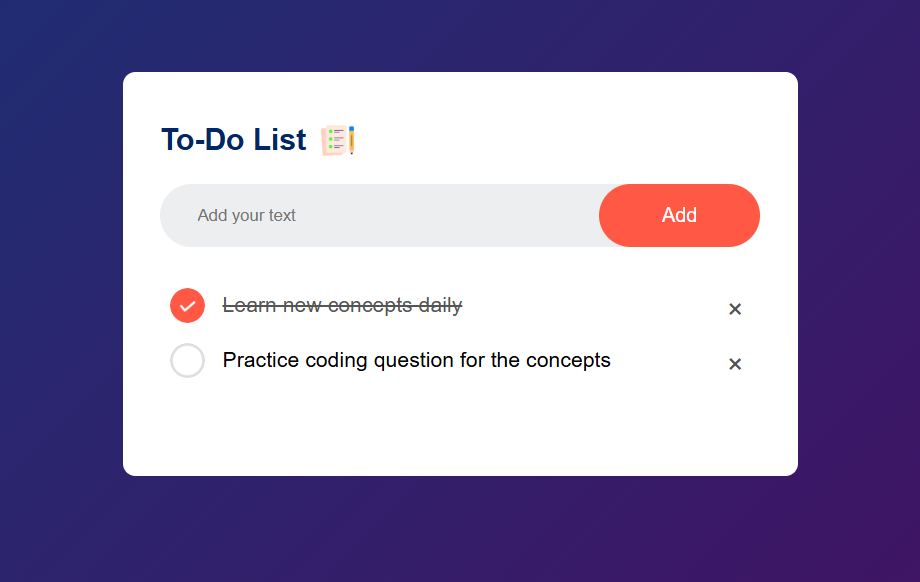

# 📋 To-Do List App ✅

A clean and responsive To-Do List web app built with HTML, CSS, and JavaScript ✨  
Quickly add 📝, check ✅, and delete ❌ tasks — with your progress saved in local storage 💾.

---

## 🌐 Live Demo

👉 [View Live Demo](https://siddhesh-kulkarni.github.io/To-do-List-JS/)

---

## 🖼️ Screenshot



---

## ✨ Features

- 🧠 Add tasks easily
- ✅ Mark tasks as completed
- ❌ Delete individual tasks
- 💾 Save tasks using `localStorage` (persistent after page reload)
- 📱 Fully responsive design for mobile and desktop
- 🖼️ Custom checked/unchecked icons

---

## 🛠️ Tech Stack

- HTML5
- CSS3 (Flexbox + Media Queries)
- JavaScript (ES6)
- `localStorage` for persistent data

---

## 🚀 Getting Started

### 1. Clone the repository:
```bash
git clone https://github.com/siddhesh-kulkarni/todo-list-app.git
